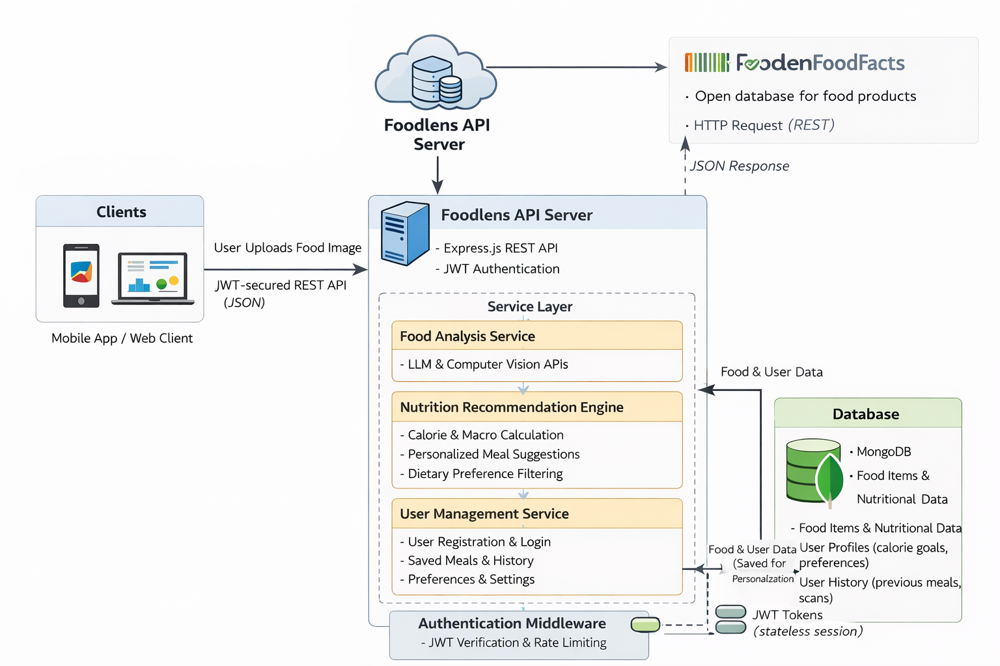

# 🥗 Foodlens Backend

**Backend system powering a food analysis & nutrition intelligence platform**

Foodlens is a backend-first application designed to analyze packaged food products and provide **personalized nutrition insights** based on user preferences and health goals.  
The system integrates with **OpenFoodFacts** to fetch real-world product data using barcodes and processes it through a clean, scalable backend architecture.

---

## 🚀 Why Foodlens Exists

Most people consume packaged food without understanding:
- What nutrients they are consuming
- Whether a product aligns with their health goals
- How different foods affect them over time

Foodlens solves this by:
- Scanning food barcodes
- Fetching verified product data from OpenFoodFacts
- Analyzing nutrition values
- Personalizing insights based on user profiles

The backend is responsible for **data ingestion, analysis, personalization, and history tracking**.

---

## 🧠 What This Backend Does

- Acts as the **central intelligence layer**
- Fetches food product data via barcode
- Processes nutrition information
- Applies personalization logic
- Stores user food history securely
- Serves REST APIs to mobile / web clients

---

## 🧱 System Architecture (High Level)

<p align="center">
  
</p>

### Architecture Overview

- Clients communicate via JWT-secured REST APIs
- Backend fetches product details from OpenFoodFacts
- Business logic lives in a dedicated service layer
- MongoDB stores users, food items, and consumption history
- Backend remains stateless (JWT-based authentication)

---

## 🔄 Data Flow (Barcode → Insight)

1. User scans a food barcode
2. Client sends barcode to backend
3. Backend queries OpenFoodFacts
4. Nutrition data is normalized & validated
5. Personalized analysis is applied
6. Result is stored and returned to the client

---

## 🧩 Core Features

- 📦 Barcode-based food lookup
- 🌐 Integration with **OpenFoodFacts**
- 🔐 JWT-based authentication
- 👤 User profile & preferences
- 🧠 Nutrition analysis logic
- 📊 Food history tracking
- 🧱 Clean Controller–Service architecture
- ⚡ RESTful API design

---

## 🧰 Tech Stack

| Layer | Technology |
|-----|-----------|
| Backend | Node.js, Express.js |
| Authentication | JWT |
| Database | MongoDB |
| External Data | OpenFoodFacts |
| Security | bcrypt, middleware-based auth |
| API Style | REST (JSON) |

---

## 📂 Project Structure

```text
src/
 ├── controllers/     # Request handling
 ├── services/        # Business logic
 ├── routes/          # API routes
 ├── models/          # MongoDB schemas
 ├── middlewares/     # Auth & validation
 ├── utils/           # Helpers & integrations
 └── app.js
```

---

## 🛡️ Security Considerations

- Passwords hashed using bcrypt
- JWT used for stateless auth
- Input validation at service level
- No sensitive data exposed to clients

---

## 🧠 What I Learned From This Project

- Designing product-oriented backend systems
- Integrating third-party data sources safely
- Structuring scalable REST APIs
- Applying business logic in service layers
- Handling real-world data inconsistencies
- Backend support for mobile applications

---

## 🚧 Future Improvements

- Advanced nutrition scoring
- Daily / weekly nutrition reports
- Caching OpenFoodFacts responses
- Recommendation engine enhancements
- Deployment with monitoring & logging

---

## 🙌 Author

Built by **Samarth Gupta**

Backend-focused fresher passionate about **APIs, system design, and real-world backend problems**
